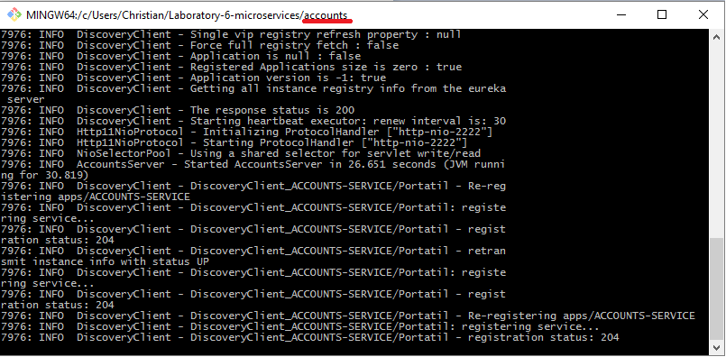
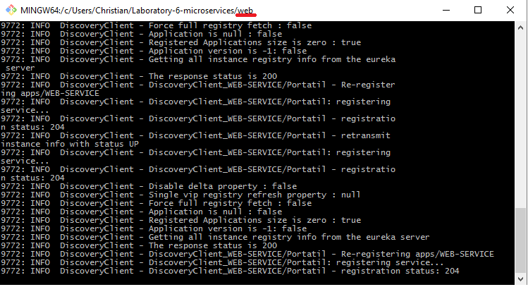
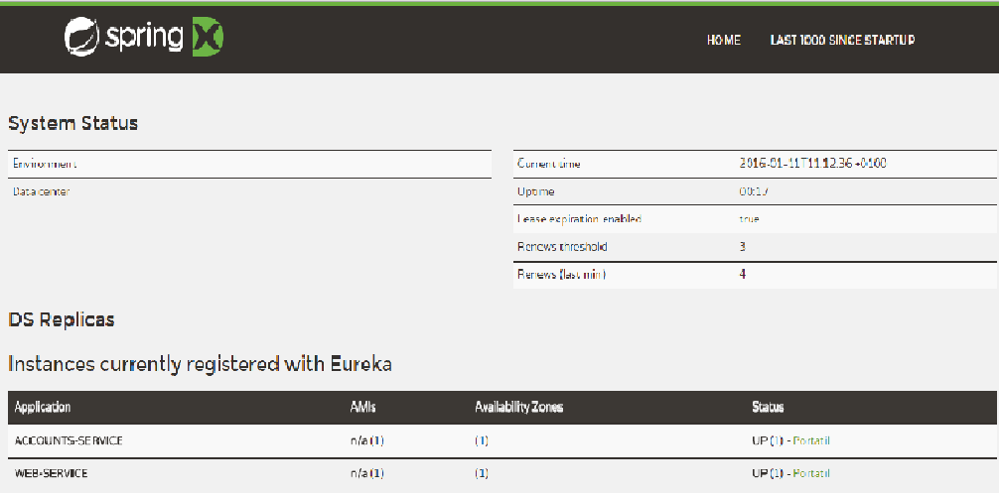
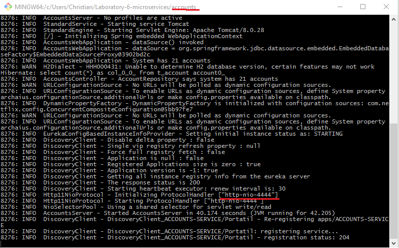

# Web Engineering 2015-2016 / Microservices

## The two microservices are running and registered

## The service registration service has the two microservices registered

## A second account microservice is running in the port 4444 and it is registered

## A brief report describing what happens when you kill the microservice with port 2222. Can the web service provide information about the accounts? Why?

When you kill the microservice with the port 2222, the service detects that another accounts service is running with the port 4444 and the service continue working.
Only the service with the port 2222 is replaced by the service with the port 4444.